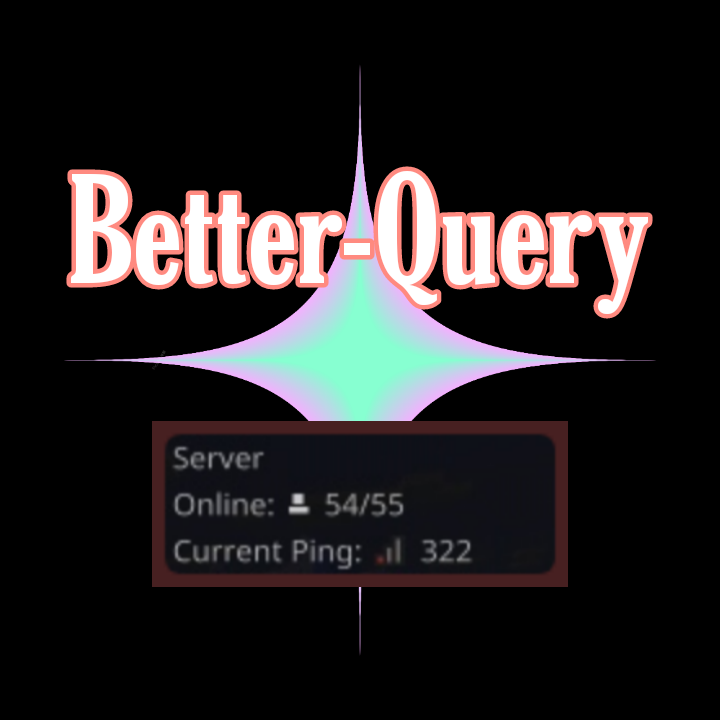
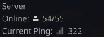

# The Better-Query Plugin

<strong>
This Plugin implements Better Query System **(i.e. Your query will be shown like this)** 

You will need a pocketmine server of at least version 4.0.0+</strong>

# How to Install
- Download the latest phar.
- Put the plugin phar to the plugins Folder of your pocketmine server.
- Restart the server. 
